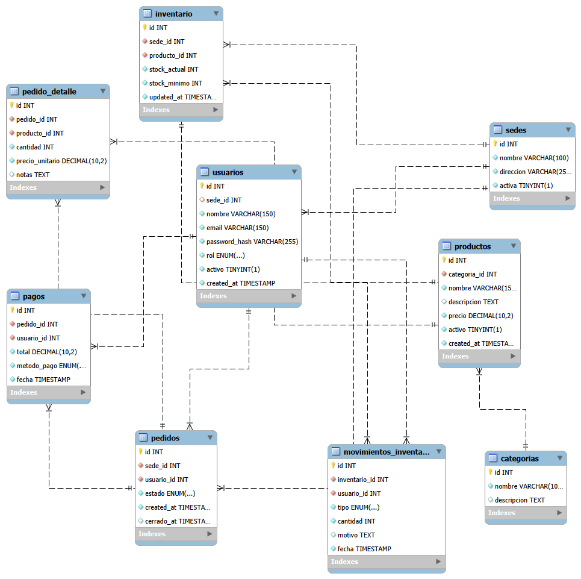

# Modelo Relacional — Bar Inventory API

## Diagrama



---

## Entidades y atributos

### sedes
Representa las sucursales físicas del bar. Es el nodo raíz del sistema multisede.

| Columna | Tipo | Restricciones |
|---|---|---|
| id | INT | PK, AUTO_INCREMENT |
| nombre | VARCHAR(100) | UNIQUE, NOT NULL |
| direccion | VARCHAR(255) | NOT NULL |
| activa | BOOLEAN | NOT NULL, DEFAULT 1 |

---

### usuarios
Personas que operan el sistema. Pueden ser administradores (sin sede fija), cajeros o meseros.

| Columna | Tipo | Restricciones |
|---|---|---|
| id | INT | PK, AUTO_INCREMENT |
| sede_id | INT | FK → sedes.id, NULL (admins sin sede fija) |
| nombre | VARCHAR(150) | NOT NULL |
| email | VARCHAR(150) | UNIQUE, NOT NULL |
| password_hash | VARCHAR(255) | NOT NULL |
| rol | ENUM | `admin`, `cajero`, `mesero` |
| activo | BOOLEAN | NOT NULL, DEFAULT 1 |
| created_at | TIMESTAMP | AUTO |

**Relación:** N usuarios pertenecen a 1 sede (excepto admins).

---

### categorias
Catálogo global de categorías de productos. No está ligado a ninguna sede.

| Columna | Tipo | Restricciones |
|---|---|---|
| id | INT | PK, AUTO_INCREMENT |
| nombre | VARCHAR(100) | UNIQUE, NOT NULL |
| descripcion | TEXT | |

---

### productos
Catálogo global de productos. El precio es el precio de venta vigente.

| Columna | Tipo | Restricciones |
|---|---|---|
| id | INT | PK, AUTO_INCREMENT |
| categoria_id | INT | FK → categorias.id, NOT NULL |
| nombre | VARCHAR(150) | NOT NULL |
| descripcion | TEXT | |
| precio | DECIMAL(10,2) | NOT NULL |
| activo | BOOLEAN | NOT NULL, DEFAULT 1 |
| created_at | TIMESTAMP | AUTO |

**Relación:** N productos pertenecen a 1 categoría.

---

### inventario
Stock actual de un producto en una sede específica. La clave compuesta
`(sede_id, producto_id)` garantiza que no haya duplicados por combinación sede-producto.

| Columna | Tipo | Restricciones |
|---|---|---|
| id | INT | PK, AUTO_INCREMENT |
| sede_id | INT | FK → sedes.id, UNIQUE con producto_id |
| producto_id | INT | FK → productos.id, UNIQUE con sede_id |
| stock_actual | INT | NOT NULL, DEFAULT 0 |
| stock_minimo | INT | NOT NULL, DEFAULT 0 |
| updated_at | TIMESTAMP | AUTO UPDATE |

**Restricción única:** `(sede_id, producto_id)` — un registro de inventario por par sede-producto.

---

### movimientos_inventario
Auditoría de cada cambio de stock. Cada movimiento referencia el registro de inventario
que modifica, quién lo hizo y por qué.

| Columna | Tipo | Restricciones |
|---|---|---|
| id | INT | PK, AUTO_INCREMENT |
| inventario_id | INT | FK → inventario.id, NOT NULL |
| usuario_id | INT | FK → usuarios.id, NOT NULL |
| tipo | ENUM | `entrada`, `descuento_venta`, `ajuste_manual` |
| cantidad | INT | NOT NULL |
| motivo | TEXT | |
| fecha | TIMESTAMP | AUTO |

---

### pedidos
Orden de consumo creada por un mesero en una sede. El estado fluye
de `abierto` a `pagado` cuando el cajero procesa el pago.

| Columna | Tipo | Restricciones |
|---|---|---|
| id | INT | PK, AUTO_INCREMENT |
| sede_id | INT | FK → sedes.id, NOT NULL |
| usuario_id | INT | FK → usuarios.id, NOT NULL |
| estado | ENUM | `abierto`, `pagado` — DEFAULT `abierto` |
| created_at | TIMESTAMP | AUTO |
| cerrado_at | TIMESTAMP | NULL hasta que se paga |

---

### pedido_detalle
Ítems de un pedido. `precio_unitario` es un **snapshot** del precio del producto
al momento de agregar el ítem — no se actualiza si el precio del producto cambia después.

| Columna | Tipo | Restricciones |
|---|---|---|
| id | INT | PK, AUTO_INCREMENT |
| pedido_id | INT | FK → pedidos.id, NOT NULL |
| producto_id | INT | FK → productos.id, NOT NULL |
| cantidad | INT | NOT NULL |
| precio_unitario | DECIMAL(10,2) | NOT NULL (snapshot) |
| notas | TEXT | |

**Decisión de diseño:** el precio se captura como snapshot para garantizar que el
historial de pedidos no cambie si se modifica el precio de un producto en el futuro.

---

### pagos
Registro del pago de un pedido. Relación 1:1 con pedidos — un pedido tiene máximo un pago.

| Columna | Tipo | Restricciones |
|---|---|---|
| id | INT | PK, AUTO_INCREMENT |
| pedido_id | INT | FK → pedidos.id, UNIQUE, NOT NULL |
| usuario_id | INT | FK → usuarios.id, NOT NULL (cajero que cobró) |
| total | DECIMAL(10,2) | NOT NULL |
| metodo_pago | ENUM | `efectivo`, `tarjeta_credito`, `tarjeta_debito` |
| fecha | TIMESTAMP | AUTO |

---

## Relaciones (resumen)

```
sedes ──< usuarios
sedes ──< inventario >── productos ──< categorias
sedes ──< pedidos ──< pedido_detalle >── productos
inventario ──< movimientos_inventario >── usuarios
pedidos ──── pagos >── usuarios
pedidos ──< pedido_detalle
```

| Relación | Tipo | Descripción |
|---|---|---|
| sedes → usuarios | 1:N | Una sede tiene muchos usuarios |
| sedes → inventario | 1:N | Una sede tiene inventario por producto |
| sedes → pedidos | 1:N | Una sede tiene muchos pedidos |
| categorias → productos | 1:N | Una categoría agrupa muchos productos |
| productos → inventario | 1:N | Un producto aparece en el inventario de varias sedes |
| productos → pedido_detalle | 1:N | Un producto puede estar en muchos ítems |
| pedidos → pedido_detalle | 1:N | Un pedido tiene varios ítems |
| pedidos → pagos | 1:1 | Un pedido tiene exactamente un pago |
| inventario → movimientos_inventario | 1:N | Cada registro de inventario tiene muchos movimientos |
| usuarios → movimientos_inventario | 1:N | Un usuario puede generar muchos movimientos |
| usuarios → pagos | 1:N | Un cajero puede procesar muchos pagos |

---

## Decisiones de diseño del modelo

### Catálogo global vs por sede
`productos` y `categorias` son globales (no tienen `sede_id`). El precio está centralizado
en `productos`. Esto evita inconsistencias de precios entre sedes y simplifica el mantenimiento
del catálogo.

### Inventario por sede
El stock es por sede-producto (`inventario`). Permite que cada sucursal tenga
niveles de stock independientes con sus propios mínimos de alerta.

### Precio snapshot en pedido_detalle
`precio_unitario` se copia al momento de agregar el ítem al pedido. Si el precio
de un producto cambia después, el historial de pedidos anteriores no se altera.
Esto es un patrón estándar en sistemas de ventas.

### Rol de usuario como ENUM
Los roles (`admin`, `cajero`, `mesero`) están como ENUM en la tabla `usuarios`
en lugar de una tabla `roles` separada. Justificación: los roles son un conjunto
cerrado y conocido en tiempo de diseño. Una tabla `roles` solo añadiría un JOIN
sin beneficio real para este caso de uso.

### Nulabilidad de sede_id en usuarios
Los administradores tienen `sede_id = NULL` indicando acceso global. Es preferible
a crear un registro de sede ficticio o un rol especial sin sede.
